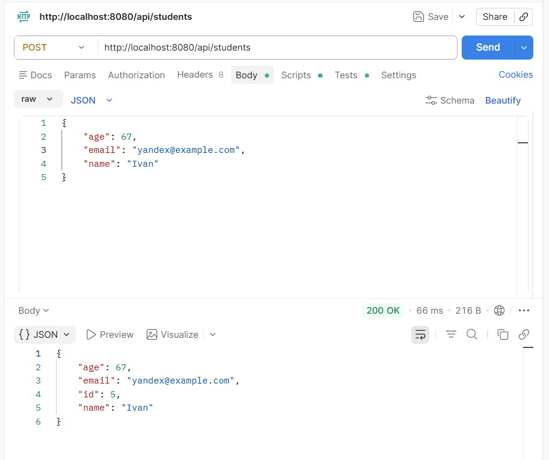
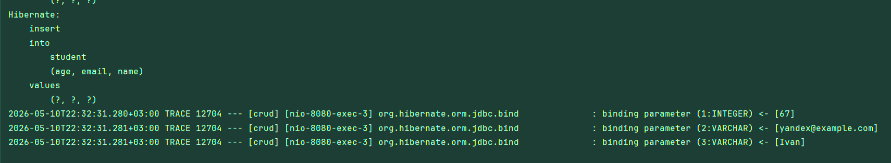

# CRUD Spring Boot Application

## Описание проекта

Учебный pet-проект по разработке REST API с использованием Java Spring Boot и PostgreSQL.

Проект реализует базовые CRUD-операции:
- создание сущностей
- получение данных
- обновление записей
- удаление записей

В проекте используется архитектура Spring Boot:
- Controller
- Service
- Repository
- Entity

## Структура проекта

```text
crud/
├── src/
│   ├── main/
│   │   ├── java/com/example/crud/
│   │   │   ├── controller/
│   │   │   │   └── StudentController.java
│   │   │   ├── entity/
│   │   │   │   └── Student.java
│   │   │   ├── repository/
│   │   │   │   └── StudentRepository.java
│   │   │   ├── service/
│   │   │   │   └── StudentService.java
│   │   │   └── CrudApplication.java
│   │   └── resources/
│   │       └── application.properties
├── .gitignore
├── pom.xml
└── README.md
```
## Используемые технологии

- Java 17
- Spring Boot
- Spring Data JPA
- PostgreSQL
- Maven
- Lombok
- Hibernate

## Функциональность

Реализованы следующие REST API методы:

| Метод | Endpoint | Описание |
|---|---|---|
| GET | /api/students | Получить всех студентов |
| GET | /api/students/{id} | Получить студента по id |
| POST | /api/students | Создать студента |
| PUT | /api/students/{id} | Обновить студента |
| DELETE | /api/students/{id} | Удалить студента |

## Настройка PostgreSQL

Создать базу данных:

```sql
CREATE DATABASE crud_db;
```

Настроить `application.properties`:

```properties
spring.datasource.url=jdbc:postgresql://localhost:5432/crud_db
spring.datasource.username=postgres
spring.datasource.password=your_password

spring.jpa.hibernate.ddl-auto=update
spring.jpa.show-sql=true
```

## Запуск проекта

Склонировать репозиторий:

```bash
git clone https://github.com/Timuuuurrk/CRUD.git
```

Перейти в папку проекта:

```bash
cd CRUD
```

Запустить приложение:

```bash
./mvnw spring-boot:run
```

После запуска API будет доступно по адресу:

```text
http://localhost:8080/api/students
```

## Тестирование API

Для тестирования использовались:
- Postman
- pgAdmin 4

Пример POST-запроса: \

Результат запроса в логах:

```json
{
  "name": "Ivan",
  "email": "ivan@example.com",
  "age": 67
}
```

Так будет выглядеть результат отправки запроса через Postman: 


## Автор
Гумеров Тимур \
Студент 2-го курса, направление 01.03.02 - Компьютерные Технологии \
Университет ИТМО


